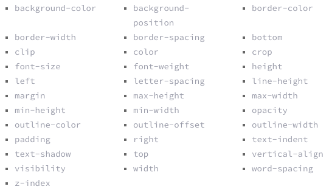

#AE to CSS
##Making the transition from animating in After Effects to CSS.

I started my dive into software design a couple years ago by creating demo videos and animating user interfaces. Coming from a Motion Design background After Effects was my baby and I had spent so many years perfecting that craft. I have worked side by side with developers recreating the animations that I had created in After Effects. This process was slow and tedious - there was a need for designer and developer to sit next to each other and hash out the details. I wanted to improve this workflow, so I dove into the research to understand how animations work within development and what the mental model was in which I needed to adapt to. After Effects was my baby but I needed to let it go and understand the new tools at my disposal. Here are some of the key findings I found that an After Effects motion designer needs to understand if their animations will ultimately be in code.

##Understand the Limitations
The world of development is constantly changing. As an animator one needs to be up to date on the current web standards and restrictions for animations.

###Understand the Properties at your disposal.
Basic List of Animatable Properties: 

[Examples of Each Property Animated](http://leaverou.github.io/animatable/)

###Consider Performance.
In After Effects you have to consider the render time of your animations. You have to do the same for code - you have to think about the performance of an animations.

Properties that are performat:

* Position
* Scale
* Rotation
* Opacity

Here is a great article by Paul Lewis and Paul Irish about [High Performance Animations.](
http://www.html5rocks.com/en/tutorials/speed/high-performance-animations/)

###Explore Whats out there:
See what other cool things are out there

SVG Animation - SVG’s can do some pretty awesome things!
Animate on Path, Trim Stroke, Change Stroke Weight, Color, SVG Filters
Here is a guide CSS-Tricks created for SVG Animations!
http://css-tricks.com/guide-svg-animations-smil/

I mean check this out!
http://codepen.io/lbebber/pen/RNgBPP?editors=110

##Thinking in Percentages vs. Frames

##Understanding Timing-Functions a.k.a. Motion Curves

% of Animation Over Time vs Property Over Time

##Understanding the possible changing variables -

Recently I have challenged myself to only animate in CSS. Making this transition had its own challenges but specifically changing my mental model on how animations work in the development world. 

Resources: 
http://css-tricks.com/almanac/properties/t/transition-timing-function/

http://www.smashingmagazine.com/2014/04/15/understanding-css-timing-functions/

But with my decision to focus on designing for software there has been a growing need for me to understand the limitations and range of animation within Front-End Development. Its been a difficult transition

development. I had started this by creating very basic websites and animations within CSS & JQuery - this helped me get by with

